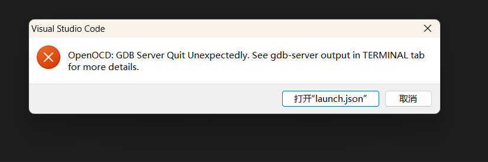

# RSOC Day1
## 运行报错
> OpenOCD: GDB Server Quit Unexpectedly. See gdb-server output in TERMINAL tab
for more details.


大概是没能连接设备，尝试以下方法
1. 插好线，摁开关
2. 没装驱动，装驱动
[en.stsw-link007-v3-13-4.zip](./en.stsw-link007-v3-13-4.zip)
[en.stsw-link009.zip](./en.stsw-link009.zip)

## git 
``` bash
git clone https://github.com/*.git

git init
git add .
git commit -m "first commit"

# 给仓库地址设置一个别名(将本地项目与GitHub上的关联)
git remote add origin https://github.com/*.git 

# 查看配置的仓库
git remote -v

# 删除别名
git remote remove origin

# （只需要push一次）给origin 增加一个可以push的地址
git remote set-url --add origin git@github.com:*.git

git push -u origin master
```
## SConscript
加入这个文件可以使在当前文件夹里的也能被调用
``` SConscript
from building import *
import os

cwd     = GetCurrentDir()
src     = Glob('*.c')
CPPPATH = [cwd]

if GetDepend(['PKG_USING_RTDUINO']) and not GetDepend(['RTDUINO_NO_SETUP_LOOP']):
    src += ['arduino_main.cpp']

group = DefineGroup('Applications', src, depend = [''], CPPPATH = CPPPATH)

list = os.listdir(cwd)
for item in list:
    if os.path.isfile(os.path.join(cwd, item, 'SConscript')):
        group = group + SConscript(os.path.join(item, 'SConscript'))

Return('group')
```