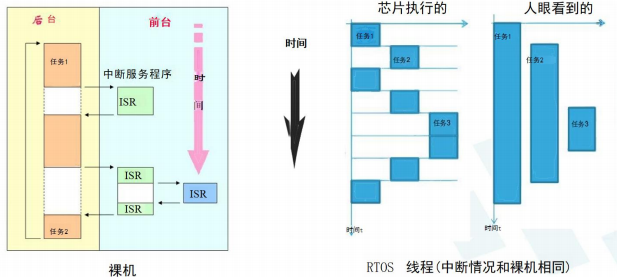
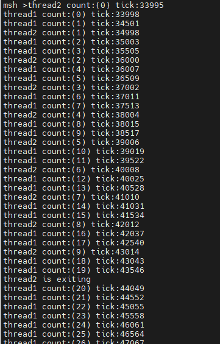

# Day 2
## RTOS(实时系统)
- 确定时间完成，对外部异步事件作出正确响应
- 快、资源消耗少
- 嵌入式系统通常使用RTOS
- 多任务（线程）并发性
  

裸机并发性（多任务同时）、实时性（快）差
- 中断机制和多任务、优先级抢占和时间片轮转调度
- [RT-Thread启动流程](https://www.rt-thread.org/document/site/#/rt-thread-version/rt-thread-standard/programming-manual/basic/basic?id=rt-thread-%e5%90%af%e5%8a%a8%e6%b5%81%e7%a8%8b)
  

## 线程
### 线程控制块
存放线程信息的一个结构体
[参考文档链接](https://www.rt-thread.org/document/site/#/rt-thread-version/rt-thread-standard/programming-manual/thread/thread?id=%e7%ba%bf%e7%a8%8b%e6%8e%a7%e5%88%b6%e5%9d%97)
### 线程栈
切换线程时，保存当前线程的上下文信息
存放局部变量
### 示例
代码参考[]

## 经验分享
一个人忙不过来→多人协同→版本混乱、成果共享难……
### 方法
#### 软件开发管理
- 版本控制 **用git**
可本地离线使用、备份、版本与分支  
- 代码review（审核）
- bug管理 -issue
#### CI持续集成管理
自动编译，报错，避免漏、错交
#### 常见问题
##### HardFault
> lr可能存的是死前的线程地址
- 栈内存写穿（数组越界）
- 栈溢出（分配给线程的内存不够、函数调用太深）
##### 解决方法-排除法
> 两组环境，缩小差异，最终一致，找到问题
#### 效率工具
- Ulog 彩色
- Utest 
> menuconfig 输入“/”可以搜索
