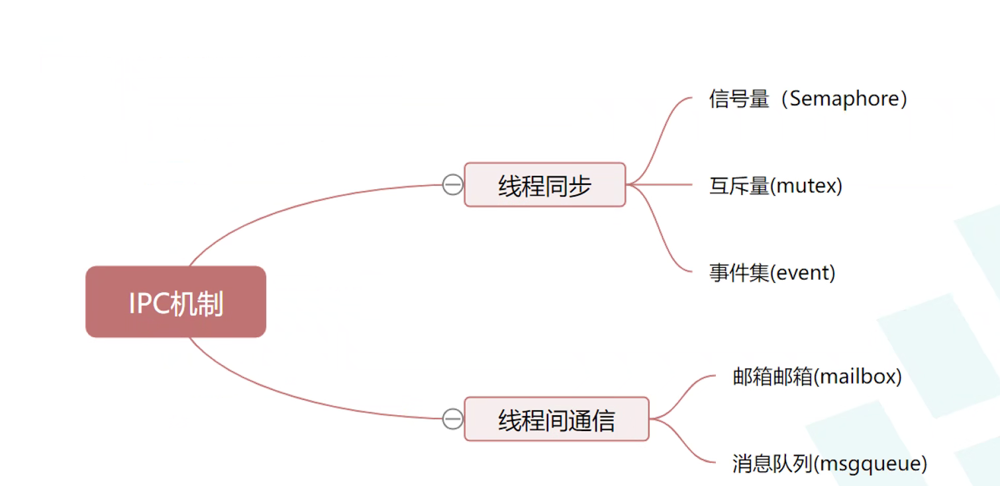
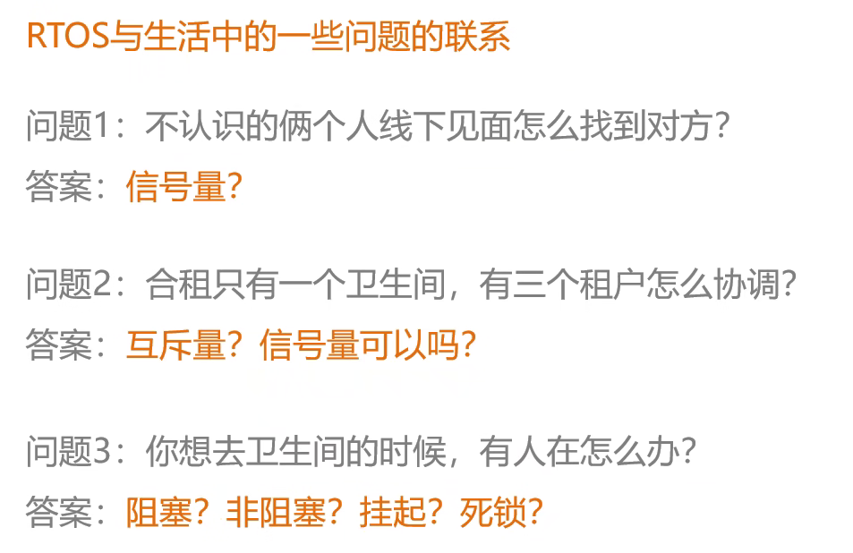
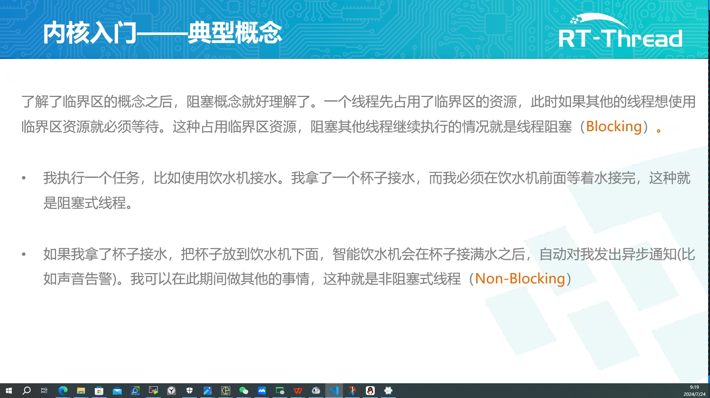
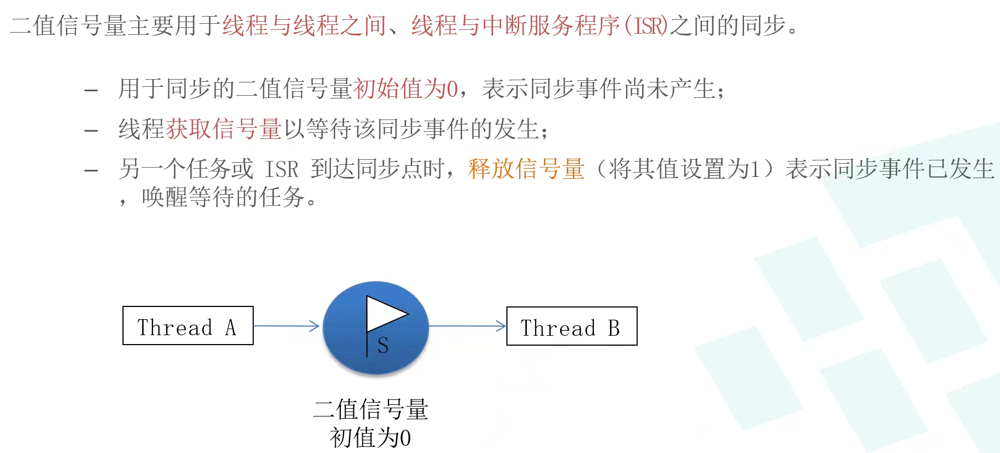
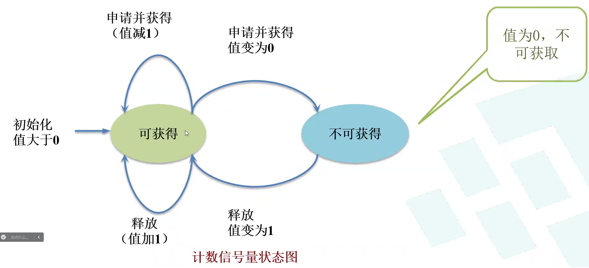

# Day 3 IPC


1. √
2. ？
3. 
## 临界区
only one can use the resource at a time

有人用了,别人就不能用

## 阻塞非阻塞
Blocking/Non-blocking

阻塞: 等待,一个线程
？？？
非阻塞: 不等待

## 挂起
？？？
<!-- ## 同步
一个线程在等待另一个线程
## 异步
一个线程在等待另一个线程,另一个线程在等待另一个线程 -->

## 死锁
两个线程互相等待

<!-- ## 互斥
两个线程不能同时使用资源 -->
## 信号量
用于线程间同步、互斥
- 二值信号量 约等于bool 获得1，不得0

- 计数信号量 初始为期待的值？？？
- 
？？？
- 裸机 根据全局变量flag 反应（错误、破坏、不能挂起一直停在这……？？？）
- 用系统的api，不要flag
- 三种反应：一直等，等一会，不等
## api
### √ 创建信号量（动态）节省资源，动态分配，可能内存破坏
？？？
注意区别？
``` c
rt_sem_t rt_sem_create(const char* name, rt_uint32_t value, rt_uint8_t flag);
// flag:RT_IPC_FLAG_FIFO先进先出/RT_IPC_FLAG_PRIO优先级
```
### √ 删除信号量
？？？
``` c
rt_err_t rt_sem_delete(rt_sem_t sem);
```
### 初始化信号量(静态)还在内存，别人也用不了
``` c
rt_err_t rt_sem_init(rt_sem_t sem, const char* name, rt_uint32_t value, rt_uint8_t flag);
```
### 脱离信号量
从内核对象管理器中脱离

### 获取信号量
time 单位tick
？？？

### 无等待获取信号量
``` c
rt_err_t rt_sem_trytake(rt_sem_t sem);
```
### 释放信号量
``` c
rt_err_t rt_sem_release(rt_sem_t sem);
```