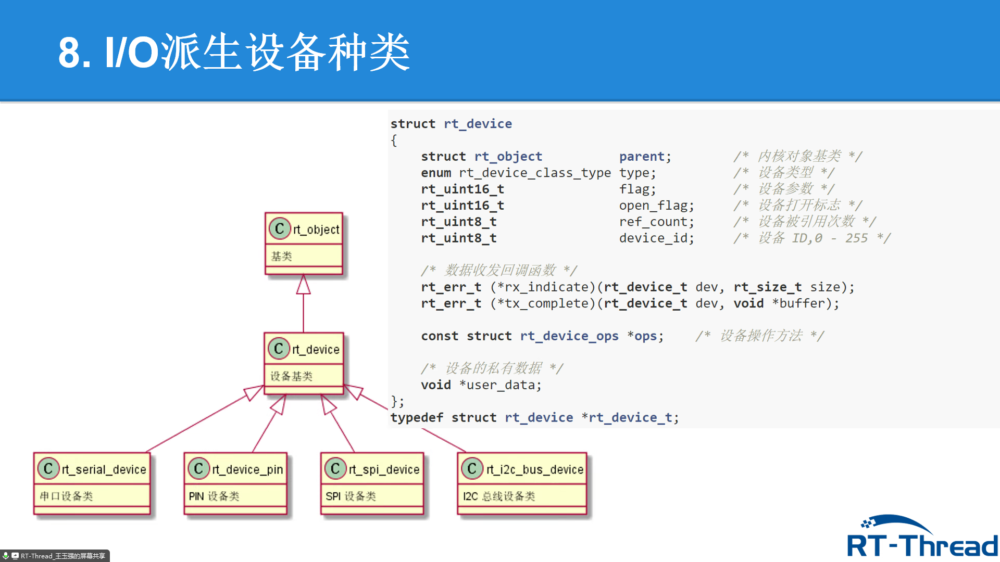
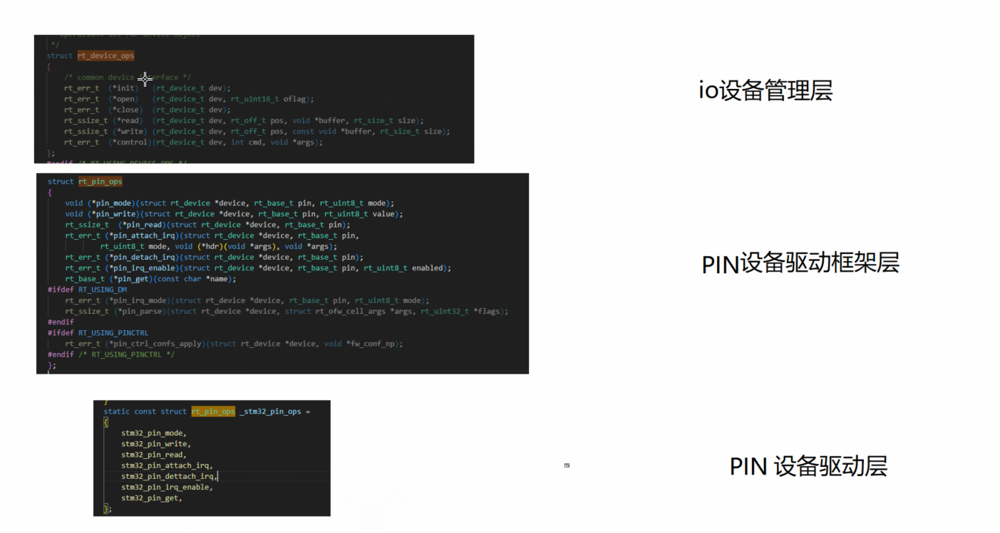

### I/O框架
显示屏、串口通信、flash、SD卡、以太网接口
图
open,close...
### 派生设备种类

### 字符设备、块设备
#### 字符设备
顺序读取：键盘、串口
#### 块设备
随机读取：硬盘、SD卡、NAND FLASH
### 为什么分类设备
一类的控制相同
### 例子
RT_D

## 
### 创建销毁设备
### 注册销毁
### flags
分行？
### 实验1：注册

### 访问
### 查找、初始化
### 打开、关闭
### 打开标志位
### 控制设备
### 读写设备
### 回调
### 调用关系图

IO设备管理层
PIN设备驱动框架层
PIN设备驱动层

## GPIO
引脚：电源、时钟、控制、I/O
GPIO,功能复用I/O
可编程控制中断

rt_pin_mode()
rt_pin_write()
rt_pin_read()

### 外部中断

## I2C总线
