# 设备驱动
##  I/O设备框架概念
### SPI驱动和设备驱动分离，提供统一的API：
• 更换 MCU 只需要改变对应的对接驱动
• 重新驱动设备，只需要重新编写设备驱动相关的代码
• 同一 API 接口，学习成本低
• 分离后设备驱动可以入库，供公司其他项目使用，减少碎片化开发，防止反复造轮子
• 代码框架会变复杂，但是从上面的优点来看是值得的
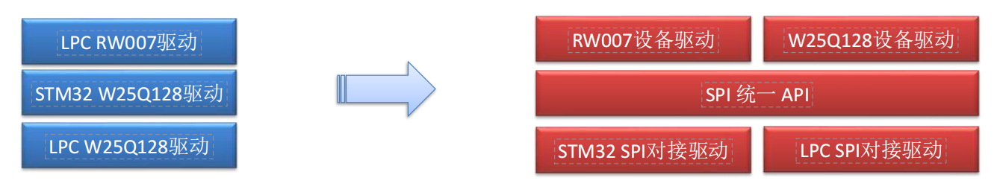
### I/O框架
I/O设备：显示屏、串口通信、flash、SD卡、以太网接口……
接口：open,close...
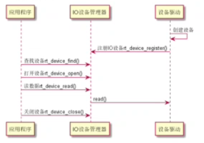
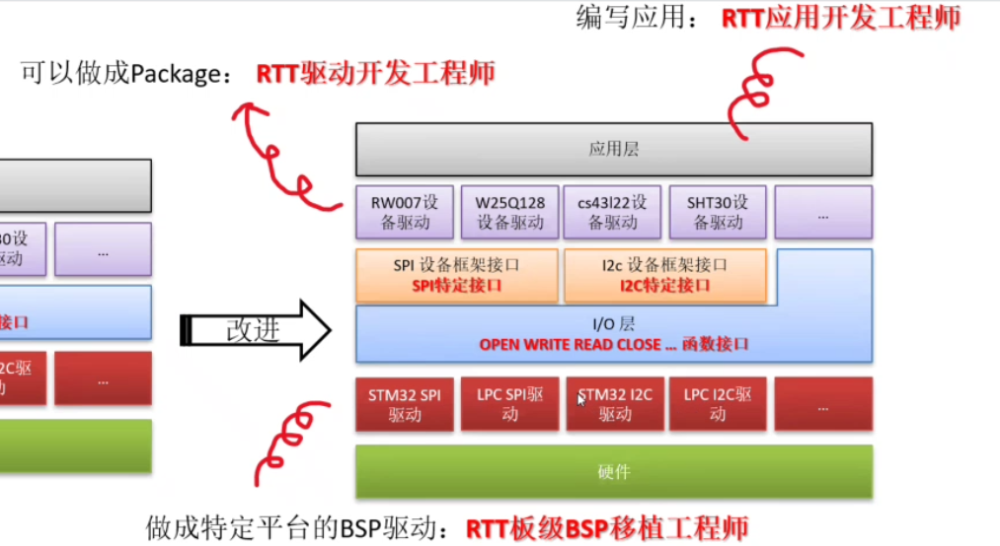
### 派生设备种类

``` c 
RT_Device_Class_Char             /* 字符设备       */
RT_Device_Class_Block            /* 块设备         */
RT_Device_Class_NetIf            /* 网络接口设备    */
RT_Device_Class_MTD              /* 内存设备       */
RT_Device_Class_RTC              /* RTC 设备        */
RT_Device_Class_Sound            /* 声音设备        */
RT_Device_Class_Graphic          /* 图形设备        */
RT_Device_Class_I2CBUS           /* I2C 总线设备     */
RT_Device_Class_USBDevice        /* USB device 设备  */
RT_Device_Class_USBHost          /* USB host 设备   */
RT_Device_Class_SPIBUS           /* SPI 总线设备     */
RT_Device_Class_SPIDevice        /* SPI 设备        */
RT_Device_Class_SDIO             /* SDIO 设备       */
RT_Device_Class_Miscellaneous    /* 杂类设备        */

```
### 字符设备、块设备
#### 字符设备
顺序读取：键盘、串口
#### 块设备
随机读取：硬盘、SD卡、NAND FLASH
### 为什么分类设备
一类的控制相同
### 例子
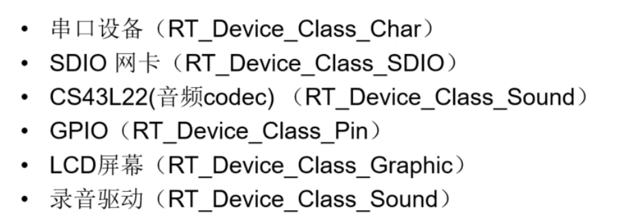

## api
[点击查看官网文档api介绍](https://www.rt-thread.org/document/site/#/rt-thread-version/rt-thread-standard/programming-manual/device/device?id=%e5%88%9b%e5%bb%ba%e5%92%8c%e6%b3%a8%e5%86%8c-io-%e8%ae%be%e5%a4%87)
### 创建销毁设备
### 注册销毁
### flags
……_stream :向串口终端输出字符串
`\n `→ `\r\n`
### 实验1：注册字符设备
``` c
#include <rtthread.h>
#include <rtdevice.h>

static int rt_device_test_init(void)
{
    rt_device_t test_dev = rt_device_create(RT_Device_Class_Char,0);
    if(!test_dev)
    {
        rt_kprintf("test_dev create failed\n");
        return -RT_ERROR;
    }
    if(rt_device_register(test_dev,"test_dev",RT_DEVICE_FLAG_RDWR)!=RT_EOK)
    {
        rt_kprintf("test_dev register failed\n");
    }
    return RT_EOK;
}
MSH_CMD_EXPORT_ALIAS(rt_device_test_init,devtest, test device init);
```

### 访问设备
open,close...
### ……

### 调用关系图

IO设备管理层
PIN设备驱动框架层
PIN设备驱动层
## PIN设备

### GPIO
芯片上的引脚分为 4 类：电源、时钟、控制、I/O
I/O 口使用模式：
- GPIO（General Purpose Input Output（通用输入 / 输出））,
- 功能复用I/O（如 SPI/I2C/UART 等）

### 可编程控制中断

### 常用接口
- rt_pin_mode()
- rt_pin_write()
- rt_pin_read()
- rt_pin_attach_irq() ：绑定引脚中断回调函数
- rt_pin_irq_enable() ：使能引脚中断
- rt_pin_detach_irq() ：脱离引脚中断回调函数
……

Assert（）断言：判断是否为真，假则报错，终止运行

### 实验：外部中断
LOG 不用\n
``` c
#include <drv_gpio.h>
#include <rtdevice.h>
#include <rtthread.h>
#define LOG_TAG "pin.irq"
#define LOG_LVL LOG_LVL_DBG
#include <ulog.h>

#define KEY_UP GET_PIN(C, 5)
#define KEY_DOWN GET_PIN(C, 1)
#define KEY_LEFT GET_PIN(C, 0)
#define KEY_RIGHT GET_PIN(C, 4)

void key_up_callback(void *args) 
{ 
    int value = rt_pin_read(KEY_UP);
    LOG_I("key up value: %d\n", value);
}

void key_down_callback(void *args) 
{ 
    int value = rt_pin_read(KEY_DOWN);
    LOG_I("key down value: %d\n", value);
}

void key_left_callback(void *args) 
{ 
    int value = rt_pin_read(KEY_LEFT);
    LOG_I("key left value: %d\n", value);
}

void key_right_callback(void *args) 
{ 
    int value = rt_pin_read(KEY_RIGHT);
    LOG_I("key right value: %d\n", value);
}

static int rt_pin_irq_example(void)
{
    rt_pin_mode(KEY_UP, PIN_MODE_INPUT_PULLUP);
    rt_pin_mode(KEY_DOWN, PIN_MODE_INPUT_PULLUP);
    rt_pin_mode(KEY_LEFT, PIN_MODE_INPUT_PULLUP);
    rt_pin_mode(KEY_RIGHT, PIN_MODE_INPUT_PULLUP);

    rt_pin_attach_irq(KEY_UP, PIN_IRQ_MODE_FALLING, key_up_callback, RT_NULL);
    rt_pin_attach_irq(KEY_DOWN, PIN_IRQ_MODE_FALLING, key_down_callback, RT_NULL);
    rt_pin_attach_irq(KEY_LEFT, PIN_IRQ_MODE_FALLING, key_left_callback, RT_NULL);
    rt_pin_attach_irq(KEY_RIGHT, PIN_IRQ_MODE_FALLING, key_right_callback, RT_NULL);

    rt_pin_irq_enable(KEY_UP,PIN_IRQ_ENABLE);
    rt_pin_irq_enable(KEY_DOWN,PIN_IRQ_ENABLE);
    rt_pin_irq_enable(KEY_LEFT,PIN_IRQ_ENABLE);
    rt_pin_irq_enable(KEY_RIGHT,PIN_IRQ_ENABLE);
    
    return RT_EOK;
}
MSH_CMD_EXPORT_ALIAS(rt_pin_irq_example,irq, pin_irq_example);
```
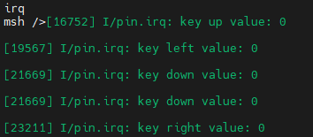
### FlexibleButton 按键库(可用)
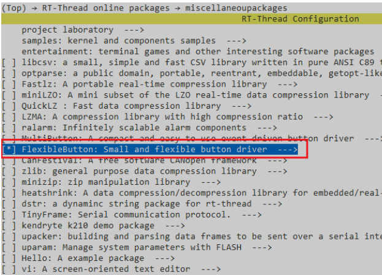
## I2C总线
[官方文档链接](https://www.rt-thread.org/document/site/#/rt-thread-version/rt-thread-standard/programming-manual/device/i2c/i2c)
I2C 是 Inter-Integrated Circuit 的简称，读作：I-squared-C
I2C 总线传输数据时只需两根信号线，一根是双向数据线 **SDA**（serial data），另一根是双向时钟线 **SCL**（serial clock）。SPI 总线有两根线分别用于主从设备之间接收数据和发送数据，而 I2C 总线只使用一根线进行数据收发。不同于 SPI 一主多从的结构，它允许同时有多个主设备存在
RTT用GPIO模拟I2C

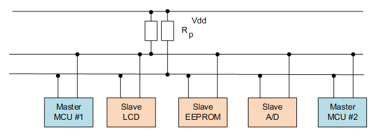
应答信号： 每传输完成一个字节的数据，接收方就需要回复一个 ACK（acknowledge）。写数据时由从机发送 ACK，读数据时由主机发送 ACK。当主机读到最后一个字节数据时，可发送 NACK（Not acknowledge）然后跟停止条件。
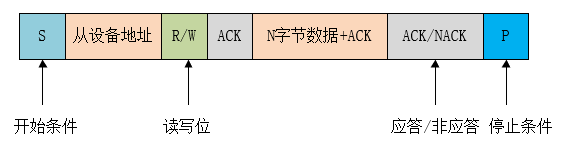
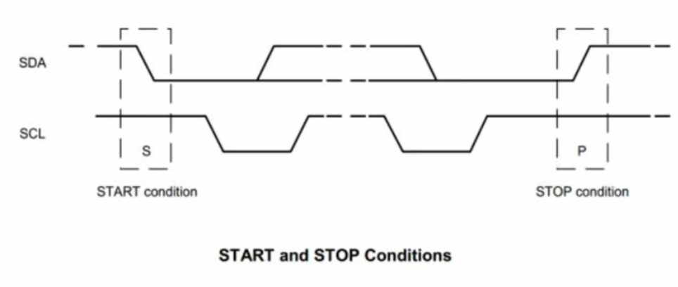
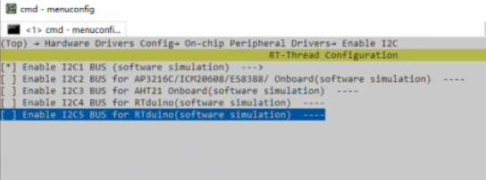
手动添加
Kconfig → drv_soft_i2c.c&h
list device 查看
六轴***：
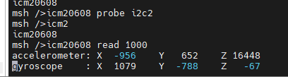
可尝试i2c-tools 软件包