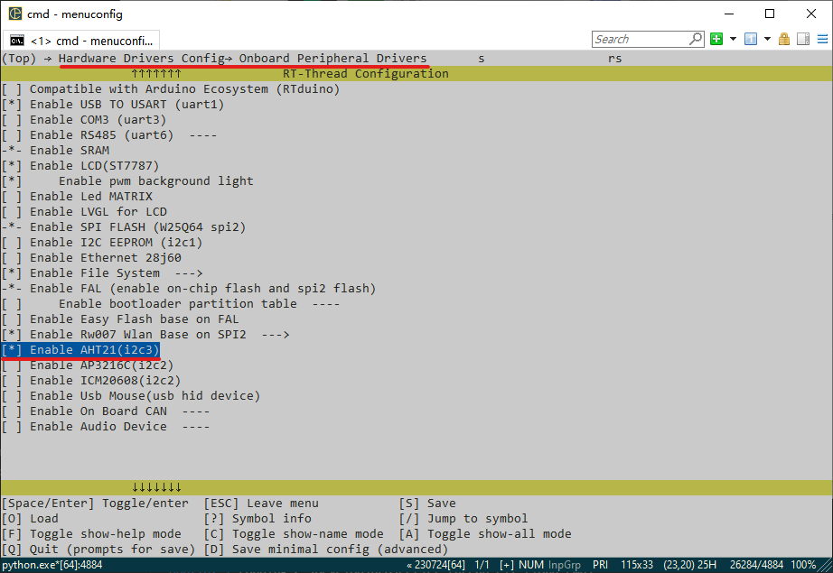
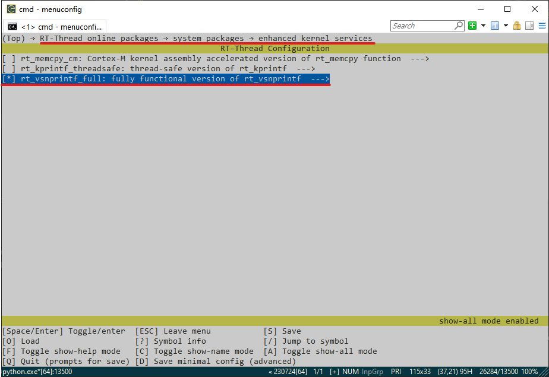
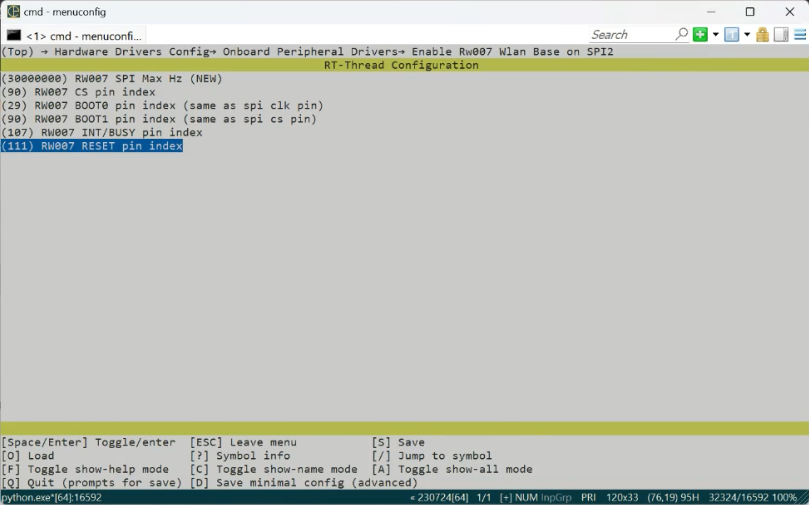
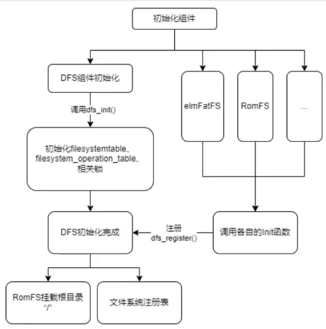
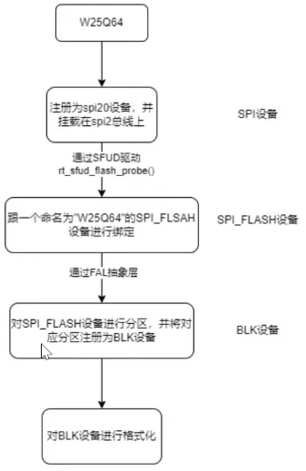
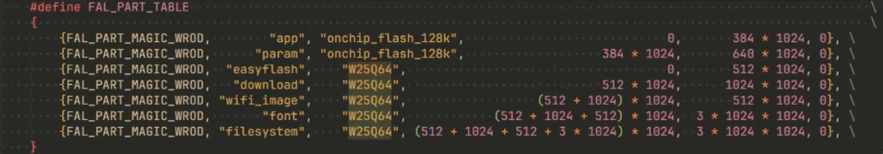
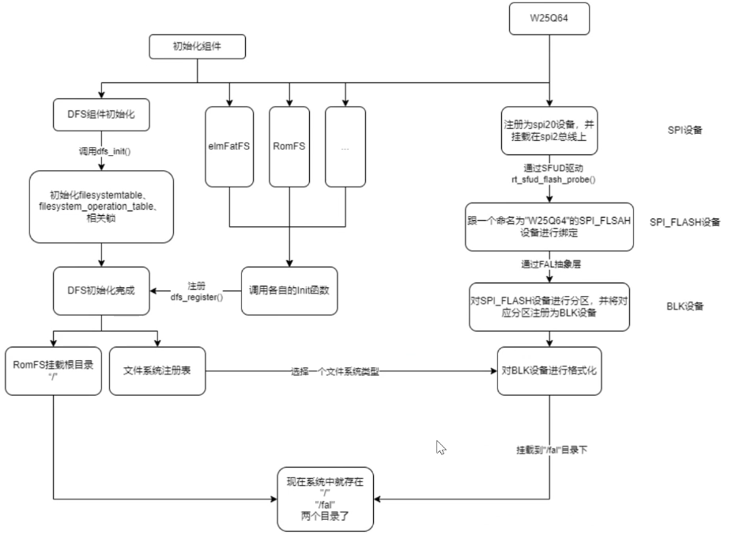

# 软件包和组件
## 软件包（Software Package）
帮助我们完成了底层驱动的编写，我们只需要使用里面提供的API就好了，帮助我们快速开发。
RT-Thread 软件包中心：[软件包](https://packages.rt-thread.org/index.html)
ENV Kconfig配置文件

### 温湿度传感器——AHT10（I2C设备）
#### 配置
在menuconfig选择,最终在[**Kconfig这里**](board\Kconfig)使能（勾选上宏）
1. 使能驱动AHT21(AHT10也适用，且会同时使能软件包)

2. 记得 `pkg --update`
3. 补充rt_vsnprintf_full软件包，使kprintf可以用`%.3f`（可以按`/`搜索）
   
4. 还是要记得 `pkg --update`

使用直接驱动的[这个ath10.c](packages\aht10-latest\aht10.c)就行了

#### 样例代码
``` c
#include <board.h>
#include <rtthread.h>
#include <drv_gpio.h>
#include "aht10.h"

// AHT挂载的总线名字
#define AHT10_I2C_BUS "i2c3"

// 创建AHT线程时待用
#define THREAD_PRIORITY 25
#define THREAD_STACK_SIZE 2048
#define THREAD_TIMESLICE 5

// AHT线程指针
rt_thread_t AHT10 = RT_NULL;

// AHT测试样例
void AHT10_Test(void *parameter)
{
    // AHT设备指针
    aht10_device_t Dev = RT_NULL;

    // Humi:湿度值,Temp:温度值
    float Humi, Temp;

    // 初始化设备
    Dev = aht10_init(AHT10_I2C_BUS);
    if (Dev == RT_NULL)
    {
        rt_kprintf("AHT10_init Fail");
        return;
    }

    while (1)
    {
        // 读取温湿度值
        Humi = aht10_read_humidity(Dev);
        Temp = aht10_read_temperature(Dev);

        // 没有下载rt_vsprintf_full软件包的时候
        rt_kprintf("Humi: %d.%d\n", (int)Humi, (int)(Humi * 10) % 10);
        rt_kprintf("Temp: %d.%d\n", (int)Temp, (int)(Temp * 10) % 10);

        // 配合rt_vsnprintf_full软件包使用
        //  rt_kprintf("Humi: %f, Temp: %f\n", Humi, Temp);

        rt_thread_mdelay(1000);
    }
}

void AHT10_Creat_Thread(void)
{
    // 创建线程
    AHT10 = rt_thread_create("AHT10", AHT10_Test, RT_NULL, THREAD_STACK_SIZE, THREAD_PRIORITY, THREAD_TIMESLICE);
    // 创建成功就启动
    if (AHT10 != RT_NULL)
    {
        rt_thread_startup(AHT10);
    }
    else
    {
        rt_kprintf("AHT10_Thread Create Fail");
    }
}
// 导出Shell命令
MSH_CMD_EXPORT(AHT10_Creat_Thread, This Function will creat a AHT10 thread.);
```
### MQTT协议（搭配阿里云）
#### 原理
MQTT（Message Queuing Telemetry Transport）是一种轻量级、基于**发布-订阅**模式的消息传输**协议**(基于TCP/IP?)，适用于资源受限的设备和低带宽、高延迟或不稳定的网络环境。它在**物联网**应用中广受欢迎，能够实现传感器、执行器和其它设备之间的高效通信。如果有设备需要获取某个传感器的消息，只需要**订阅这个主题**就好了。
#### 运行框架
**Client**：客户端，即我们使用的设备。

使用MQTT的程序或设备。客户端总是通过网络连接到服务端。它可以

- 发布应用消息给其它相关的客户端。
- 订阅以请求接受相关的应用消息。
- 取消订阅以移除接受应用消息的请求。
- 从服务端断开连接。

**Server**：服务端

作为发送消息的客户端和请求订阅的客户端之间的中介。服务端

- 接受来自客户端的网络连接。
- 接受客户端发布的应用消息。
- 处理客户端的订阅和取消订阅请求。
- 转发应用消息给符合条件的已订阅客户端。

**Topic Name**：主题名

附加在应用消息上的一个标签，服务端已知且与订阅匹配。服务端发送应用消息的一个副本给每一个匹配的客户端订阅。

**Subscription**： 订阅

订阅相应的主题名来获取对应的信息。

**Publish**：发布

在对应主题上发布新的消息。


**参考链接**：[MQTT 协议入门：基础知识和快速教程](https://www.emqx.com/zh/blog/the-easiest-guide-to-getting-started-with-mqtt)

#### 阿里云搭建

平台：[https://www.aliyun.com/product/iot/iot_instc_public_cn](https://www.aliyun.com/product/iot/iot_instc_public_cn)

1. **控制管理台** → **注册登录** → 公共实例 → （左栏）设备管理 → 产品 → 创建产品（名称随便，其它默认）→
2. Topic 类列表 → 自定义 Topic → 将get的权限改为“发布和订阅”
3. 功能定义 → 前往编辑草稿 → 添加自定义功能（标识符发布时要用，步长即精度）→ 发布上线
4. 创建设备（产品选择之前创建的）
5. 打开RW007(网络连接)，注意修改对应数字
    
6. menuconfig 阿里云软件包配置相应名称密码（在对应**产品**页顶端，**设备**页**MQTT连接参数**点击“查看”），同时**使能下方sample**（图中没标出）
   
7. `pkg --update`
8. 把此处[packages\ali-iotkit-v3.0.2\ports\wrapper.c](packages\ali-iotkit-v3.0.2\ports\wrapper.c)的`RT_WEAK`改为`rt_weak`
#### MQTT样例
1. 以下代码实现拼接，`DEMO_PRODUCT_KEY, DEMO_DEVICE_NAME`分别替代两个`%s`
``` c
const char     *fmt = "/sys/%s/%s/thing/event/property/post";
//...
HAL_Snprintf(topic, topic_len, fmt, DEMO_PRODUCT_KEY, DEMO_DEVICE_NAME);
```
1. 这个报错不用管`E/[RW007]: The wifi Stage 1 status 0 0 0 1`
2.  编译、运行、输入`wifi join wifiname wifisecret`
3.  在阿里云网页日志服务可以查看发送的消息
4.  在阿里云网页对应设备Topic列表可以发布消息（msh中可以收到）
5.  发现运行时，shell命令用不了了，因为样例导出的命令用shell线程去跑
6.  要把导出的封装为线程,即加入以下内容且把`mqtt_example_main()`的参数改为`void *parameter`
``` c
#define THREAD_PRIORITY 25
#define THREAD_STACK_SIZE 4096
#define THREAD_TIMESLICE 5

rt_thread_t MQTT_Thread = RT_NULL;

void MQTT_Creat_Thread(void)
{    
    MQTT_Thread = rt_thread_create("MTQQ_Thread", mqtt_example_main, RT_NULL, THREAD_STACK_SIZE, THREAD_PRIORITY, THREAD_TIMESLICE);

    if (MQTT_Thread != RT_NULL)
    {
        rt_thread_startup(MQTT_Thread);
    }
    else
    {
        rt_kprintf("MQTT Thread Create Failed!\n");
    }
    
}
MSH_CMD_EXPORT(MQTT_Creat_Thread, create a MQTT_Thread);
```
## 组件
可以独立开发、测试、测试、部署和维护的软件单元
*与软件包关系： 组件如手脚，软件包如工具，都可以选择是否使用*

### 文件系统
用板载的W25Q64（Flash）来学习
#### 文件系统定义
DFS, Device File System, RTT提供的虚拟文件系统组件
#### 文件系统架构
统一**根目录**用`/`表示，可以挂载目录、文件，允许不同目录下的**同名文件**

POSIX：一个协议，统一api名称，使代码可以在不同的操作系统中跑
ELM FATFS 文件系统：常用，RomFS系统：只读 （下文继续介绍）

#### 文件系统种类
| 类型      | 特点 |
| - | - |
| FatFS      | 小型嵌入式设备，兼容微软，有良好的硬件无关性，RTT最常用，如:elm_fat       |
| RomFS   | 挂载根目录，只读        |
| DevFS | 设备文件系统，开启后设备在`/dev`虚拟成文件，可用read、write接口 |
| UFFS | 图文开发，用于Nand Flash，快、资源消耗少、免费 |
| NFS | 网络文件系统，用于网络连接操作另一台设备 |
#### POSIX接口层
一个协议，统一api名称，使代码可以在不同的操作系统中跑
**4个重要接口**

文件描述符：fd(file descriptor),对应一个文件，可能多对一（把我们找到需要的文件）
还有：
``` c
int rename(const char *old, const char *new); //重命名
int stat(const char *file, struct stat *buf); //取得状态
int unlink(const char *pathname); //删除文件
```
#### 目录管理
目录常用api

#### 文件系统启动流程
| 名称 | 补充 |
| - | - |
| filesystemtable | 记录所用的文件系统 |
| filesystem_operation_table | 记录操作函数如何实现（如open，close……）|
|相关锁 | 如fd的互斥锁等 |



### FAL (搭配SFUD驱动使用)
#### SFUD
**[SFUD](https://github.com/armink/SFUD)**：(Serial Flash Universal Driver) 串行 **Flash 通用驱动库**，如：sfud_get_device（）、sfud_read（）、sfud_erase（）、sfud_write（）等函数接口帮助我们能够**实现对不同Flash的读写**。
#### FAL
**Fal组件**：(Flash Abstraction Layer) Flash 抽象层
调用SFUD，**将Flash分区，创建块设备**，文件系统要在块设备上搭建
[FAL 框架图](https://www.rt-thread.org/document/site/#/rt-thread-version/rt-thread-standard/programming-manual/fal/fal)
#### FAL API
[**FAL API详细链接**](https://www.rt-thread.org/document/site/#/rt-thread-version/rt-thread-standard/programming-manual/fal/fal_api)

#### FAL 初始化流程
W25Q64→注册为spi20设备，挂载到spi2总线上（**SPI设备**）→*通过SFUD驱动*`rt_sfud_flash_probe()`→跟一个命名为"W25Q64"的SPI_FLASH设备进行绑定(**SPI_FLASH设备**)→*通过FAL抽象层*→对SPI_FLASH设备进行分区，将对应分区注册为BLK（块）设备（**BLK设备**）→对BLK设备格式化

**分区表**
| （不用管） | 分区名称 | 位置 | 偏移量 | 大小 |
| --- | --- | --- | --- | --- |



### DFS结合FAL配置W25Q64



## 我的实践
### 读取传感器数据，上传到阿里云
（合并头两个代码），拼接字符串时我用了`sprintf`，其实应该也可以样例原有的`HAL_Snprintf`的
``` c
#include "rtthread.h"
#include "dev_sign_api.h"
#include "mqtt_api.h"
#include <board.h>
#include <drv_gpio.h>
#include <stdio.h>
#include <string.h>
#include "aht10.h"

char DEMO_PRODUCT_KEY[IOTX_PRODUCT_KEY_LEN + 1] = {0};
char DEMO_DEVICE_NAME[IOTX_DEVICE_NAME_LEN + 1] = {0};
char DEMO_DEVICE_SECRET[IOTX_DEVICE_SECRET_LEN + 1] = {0};

void *HAL_Malloc(uint32_t size);
void HAL_Free(void *ptr);
void HAL_Printf(const char *fmt, ...);
int HAL_GetProductKey(char product_key[IOTX_PRODUCT_KEY_LEN + 1]);
int HAL_GetDeviceName(char device_name[IOTX_DEVICE_NAME_LEN + 1]);
int HAL_GetDeviceSecret(char device_secret[IOTX_DEVICE_SECRET_LEN]);
uint64_t HAL_UptimeMs(void);
int HAL_Snprintf(char *str, const int len, const char *fmt, ...);

// AHT挂载的总线名字
#define AHT10_I2C_BUS "i2c3"

    // AHT设备指针
    aht10_device_t Dev = RT_NULL;

    // Humi:湿度值,Temp:温度值
    float Humi, Temp;


#define EXAMPLE_TRACE(fmt, ...)  \
    do { \
        HAL_Printf("%s|%03d :: ", __func__, __LINE__); \
        HAL_Printf(fmt, ##__VA_ARGS__); \
        HAL_Printf("%s", "\r\n"); \
    } while(0)

static void example_message_arrive(void *pcontext, void *pclient, iotx_mqtt_event_msg_pt msg)
{
    iotx_mqtt_topic_info_t     *topic_info = (iotx_mqtt_topic_info_pt) msg->msg;

    switch (msg->event_type) {
        case IOTX_MQTT_EVENT_PUBLISH_RECEIVED:
            /* print topic name and topic message */
            EXAMPLE_TRACE("Message Arrived:");
            EXAMPLE_TRACE("Topic  : %.*s", topic_info->topic_len, topic_info->ptopic);
            EXAMPLE_TRACE("Payload: %.*s", topic_info->payload_len, topic_info->payload);
            EXAMPLE_TRACE("\n");
            break;
        default:
            break;
    }
}

static int example_subscribe(void *handle)
{
    int res = 0;
    const char *fmt = "/%s/%s/user/get";
    char *topic = NULL;
    int topic_len = 0;

    topic_len = strlen(fmt) + strlen(DEMO_PRODUCT_KEY) + strlen(DEMO_DEVICE_NAME) + 1;
    topic = HAL_Malloc(topic_len);
    if (topic == NULL) {
        EXAMPLE_TRACE("memory not enough");
        return -1;
    }
    memset(topic, 0, topic_len);
    HAL_Snprintf(topic, topic_len, fmt, DEMO_PRODUCT_KEY, DEMO_DEVICE_NAME);

    res = IOT_MQTT_Subscribe(handle, topic, IOTX_MQTT_QOS0, example_message_arrive, NULL);
    if (res < 0) {
        EXAMPLE_TRACE("subscribe failed");
        HAL_Free(topic);
        return -1;
    }

    HAL_Free(topic);
    return 0;
}

        char tmp[256];
void tmp_payload(void)
{
     // 读取温湿度值
        Humi = aht10_read_humidity(Dev);
        Temp = aht10_read_temperature(Dev);
        sprintf(tmp, "{\"params\":{\"temperature\":%.2f,\"humidity\":%.2f}}", Temp, Humi);
        rt_kprintf("\n%f %f tmp:%s\n",Humi,Temp,tmp);
        return;
}
static int example_publish(void *handle)
{
    
    
    tmp_payload();
    int             res = 0;
    const char     *fmt = "/sys/%s/%s/thing/event/property/post";
    // /k1lyriw1yGj/${deviceName}/user/get
    char           *topic = NULL;
    int             topic_len = 0;
    char           *payload = tmp;
    // strcpy(payload,tmp_payload());
    rt_kprintf("payload:%s\n",payload);
    topic_len = strlen(fmt) + strlen(DEMO_PRODUCT_KEY) + strlen(DEMO_DEVICE_NAME) + 1;
    topic = HAL_Malloc(topic_len);
    if (topic == NULL) {
        EXAMPLE_TRACE("memory not enough");
        return -1;
    }
    memset(topic, 0, topic_len);
    HAL_Snprintf(topic, topic_len, fmt, DEMO_PRODUCT_KEY, DEMO_DEVICE_NAME);

    res = IOT_MQTT_Publish_Simple(0, topic, IOTX_MQTT_QOS0, payload, strlen(payload));
    if (res < 0) {
        EXAMPLE_TRACE("publish failed, res = %d", res);
        HAL_Free(topic);
        return -1;
    }

    HAL_Free(topic);
    return 0;
}

static void example_event_handle(void *pcontext, void *pclient, iotx_mqtt_event_msg_pt msg)
{
    EXAMPLE_TRACE("msg->event_type : %d", msg->event_type);
}

static void mqtt_example_main(void *parameter)
{
    void                   *pclient = NULL;
    int                     res = 0;
    int                     loop_cnt = 0;
    iotx_mqtt_param_t       mqtt_params;

    HAL_GetProductKey(DEMO_PRODUCT_KEY);
    HAL_GetDeviceName(DEMO_DEVICE_NAME);
    HAL_GetDeviceSecret(DEMO_DEVICE_SECRET);

    EXAMPLE_TRACE("mqtt example");

    memset(&mqtt_params, 0x0, sizeof(mqtt_params));

    mqtt_params.handle_event.h_fp = example_event_handle;

    pclient = IOT_MQTT_Construct(&mqtt_params);
    if (NULL == pclient) {
        EXAMPLE_TRACE("MQTT construct failed");
        return ;
    }

    res = example_subscribe(pclient);
    if (res < 0) {
        IOT_MQTT_Destroy(&pclient);
        return ;
    }

    while (1) {
        if (0 == loop_cnt % 20) {
            example_publish(pclient);
        }

        IOT_MQTT_Yield(pclient, 200);

        loop_cnt += 1;
    }

    return ;
}


#define THREAD_PRIORITY 25
#define THREAD_STACK_SIZE 4096
#define THREAD_TIMESLICE 5

rt_thread_t MQTT_Thread = RT_NULL;

void MQTT_Creat_Thread(void)
{

    // 初始化设备
    Dev = aht10_init(AHT10_I2C_BUS);
    if (Dev == RT_NULL)
    {
        rt_kprintf("AHT10_init Fail");
        return;
    }

    MQTT_Thread = rt_thread_create("MTQQ_Thread", mqtt_example_main, RT_NULL, THREAD_STACK_SIZE, THREAD_PRIORITY, THREAD_TIMESLICE);

    if (MQTT_Thread != RT_NULL)
    {
        rt_thread_startup(MQTT_Thread);
    }
    else
    {
        rt_kprintf("MQTT Thread Create Failed!\n");
    }
    
}
MSH_CMD_EXPORT(MQTT_Creat_Thread, create a MQTT_Thread);
```

[更多参考官方文档链接](https://www.rt-thread.org/document/site/#/rt-thread-version/rt-thread-standard/programming-manual/filesystem/filesystem?id=%e6%96%87%e4%bb%b6%e7%ae%a1%e7%90%86)
